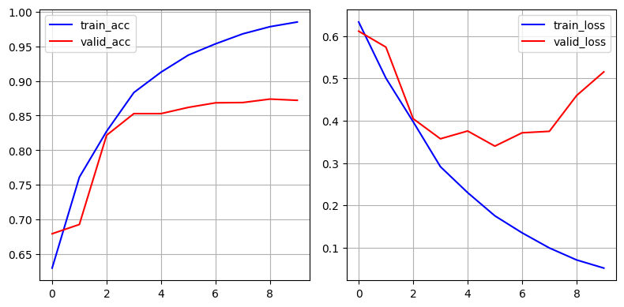
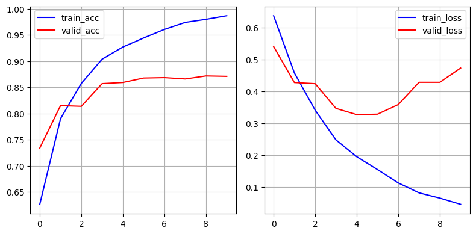
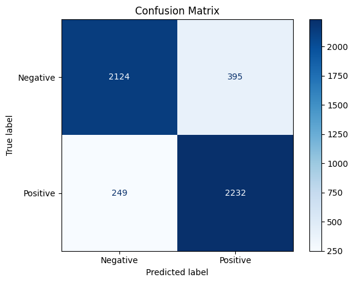
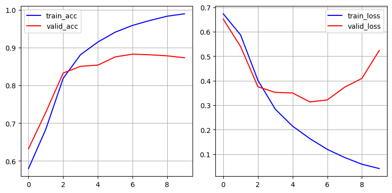
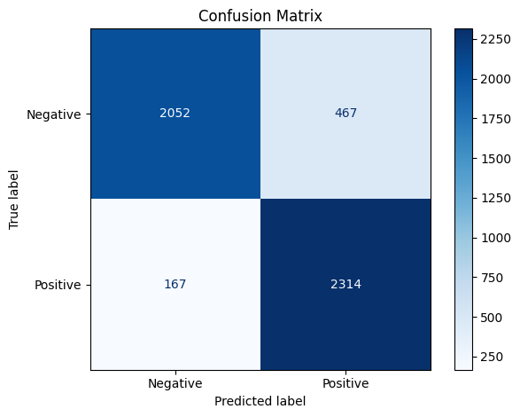

# Sentiment Analysis on IMDB Dataset Using GRU Models

This project demonstrates sentiment classification on movie reviews using three types of GRU-basedarchitectures:

- **Custom GRU**: A manually implemented GRU cell and sentiment classifier  
- **Uni-directional GRU**: A PyTorch built-in GRU processing sequences left-to-right  
- **Bi-directional GRU**: A PyTorch built-in GRU capturing context in both directions  

These models are compared in terms of training speed, accuracy, and overall performance on the IMDBdataset.
---

## Motivation

Sentiment analysis is a fundamental natural language processing task that powers applications like
customer feedback interpretation, social media monitoring, and market research. While pre-built
models and libraries exist, implementing a custom GRU from scratch provides invaluable insights
into the mechanics of recurrent neural networks and deep learning workflows.

This project aims to deepen understanding by:

    . Building a tailored GRU cell and model without relying on high-level APIs
    . Demonstrating end-to-end pipeline: tokenization, vocabulary creation, batching, training, and evaluation
    . Applying the model to a real-world dataset (IMDB movie reviews) to classify sentiments
    . Showcasing practical skills in PyTorch, data processing, and visualization

By sharing this repo, the goal is to highlight hands-on expertise and a solid grasp of fundamental
deep learning concepts, making a strong case for joining any team focused on NLP or ML engineering.

---

## Project Overview

```bash
Recurrent Neural Networks (RNNs) are a cornerstone of sequence modeling in NLP. GRUs, a type of gated
RNN, balance model complexity and efficiency, mitigating vanishing gradients while capturing long-term dependencies.

This project aims to:

- Implement a custom GRU to deepen understanding of its inner workings  
- Leverage PyTorch’s optimized GRU implementations for improved performance  
- Analyze the impact of uni-directional vs. bi-directional architectures on sentiment classification accuracy  
```
---

## Dataset & Preprocessing

```bash
We use the IMDB movie review dataset, a benchmark for sentiment analysis tasks, with labels indicating
positive or negative sentiment.

Key preprocessing steps include:

- Tokenizing reviews and building a vocabulary  
- Mapping words to integer indices  
- Padding sequences in batches for uniform input length  

The data is loaded into PyTorch DataLoaders for training and validation.
```
---

##  Project Structure

```bash

custom-gru-sentiment-analysis/
    │
    ├── model.py                 # Model definitions (GRUCell, GRUModel, GRUSentimentClassifier)
    ├── dataloader_generator.py  # Data preprocessing, tokenizer, dataset, dataloaders
    ├── utils.py                 # Training, evaluation, plotting helper functions
    ├── demo_script.py           # Main script to run training & evaluation
    ├── demo.ipynb               # Jupyter notebook demo with explanations & visualization
    ├── requirements.txt         # Project dependencies
    ├── README.md                # Project overview, and usage


```
---

## Getting Started

### Requirements

```bash
 Install dependencies with:

    pip install -r requirements.txt
    
```
 ### Running the Demo:
 ```bash
     python demo_script.py
     jupyter notebook demo.ipynb
     
  This will:
    . Build a vocabulary from the IMDB training texts
    . Preprocess and batch the data
    . Train a custom GRU-based binary classifier
    . Plot accuracy/loss curves and generate a confusion matrix

```
---

## Training Results

Training was performed for 10 epochs on each model, using binary cross-entropy loss and Adam optimizer
with learning rate 0.001.

### 1. Custom GRU
```bash

| Epoch | Train Acc | Train Loss | Valid Acc | Valid Loss | Grad Norm | Time (s) |
|-------|-----------|------------|-----------|------------|-----------|----------|
| 0     | 0.6299    | 0.6332     | 0.6794    | 0.6114     | 0.44      | 579.69   |
| 1     | 0.7611    | 0.5005     | 0.6928    | 0.5738     | 0.59      | 576.48   |
| 2     | 0.8273    | 0.3976     | 0.8216    | 0.4047     | 0.60      | 568.81   |
| 3     | 0.8832    | 0.2914     | 0.8528    | 0.3573     | 3.04      | 576.19   |
| 4     | 0.9127    | 0.2301     | 0.8528    | 0.3757     | 1.83      | 571.62   |
| 5     | 0.9373    | 0.1753     | 0.8618    | 0.3400     | 2.02      | 573.00   |
| 6     | 0.9536    | 0.1351     | 0.8684    | 0.3715     | 1.39      | 573.09   |
| 7     | 0.9679    | 0.0994     | 0.8688    | 0.3749     | 1.07      | 550.78   |
| 8     | 0.9783    | 0.0711     | 0.8738    | 0.4595     | 0.94      | 541.98   |
| 9     | 0.9850    | 0.0519     | 0.8720    | 0.5154     | 0.36      | 544.17   |

**Visualization:** See below for plots showing training curves and confusion matrix based on validation set
results.

```
---



---

### 2. Uni-directional GRU
```bash

| Epoch | Train Acc | Train Loss | Valid Acc | Valid Loss | Grad Norm | Time (s) |
|-------|-----------|------------|-----------|------------|-----------|----------|
| 0     | 0.6264    | 0.6364     | 0.7340    | 0.5402     | 0.62      | 27.37    |
| 1     | 0.7902    | 0.4573     | 0.8152    | 0.4273     | 1.09      | 26.22    |
| 2     | 0.8577    | 0.3406     | 0.8138    | 0.4237     | 1.25      | 26.09    |
| 3     | 0.9041    | 0.2479     | 0.8572    | 0.3464     | 1.45      | 26.19    |
| 4     | 0.9273    | 0.1952     | 0.8594    | 0.3269     | 0.46      | 25.71    |
| 5     | 0.9446    | 0.1549     | 0.8680    | 0.3282     | 0.65      | 25.73    |
| 6     | 0.9609    | 0.1130     | 0.8688    | 0.3584     | 1.17      | 26.11    |
| 7     | 0.9742    | 0.0819     | 0.8662    | 0.4280     | 4.05      | 25.80    |
| 8     | 0.9801    | 0.0657     | 0.8720    | 0.4280     | 1.22      | 25.63    |
| 9     | 0.9871    | 0.0462     | 0.8712    | 0.4728     | 2.59      | 25.96    |

**Visualization:** See below for plots showing training curves and confusion matrix based on validation set
results.
```
---


---

### 3. Bi-directional GRU
```bash

| Epoch | Train Acc | Train Loss | Valid Acc | Valid Loss | Grad Norm | Time (s) |
|-------|-----------|------------|-----------|------------|-----------|----------|
| 0     | 0.5800    | 0.6735     | 0.6324    | 0.6516     | 1.79      | 38.42    |
| 1     | 0.6842    | 0.5871     | 0.7290    | 0.5396     | 2.56      | 38.42    |
| 2     | 0.8186    | 0.4014     | 0.8326    | 0.3752     | 1.41      | 39.39    |
| 3     | 0.8811    | 0.2838     | 0.8504    | 0.3522     | 0.90      | 38.78    |
| 4     | 0.9146    | 0.2143     | 0.8536    | 0.3499     | 1.10      | 38.73    |
| 5     | 0.9407    | 0.1632     | 0.8754    | 0.3133     | 1.23      | 38.71    |
| 6     | 0.9587    | 0.1195     | 0.8826    | 0.3215     | 1.38      | 37.97    |
| 7     | 0.9718    | 0.0863     | 0.8810    | 0.3734     | 0.36      | 37.86    |
| 8     | 0.9830    | 0.0587     | 0.8782    | 0.4095     | 0.64      | 37.39    |
| 9     | 0.9894    | 0.0411     | 0.8732    | 0.5237     | 3.12      | 37.11    |

**Visualization:** See below for plots showing training curves and confusion matrix based on validation set
results.

```
---


---

## Next Steps

```bash
- Experiment with larger embeddings and deeper GRU layers to improve accuracy  
- Apply dropout and regularization to mitigate overfitting  
- Explore Transformer-based models for further performance gains  
- Deploy models for real-time sentiment analysis in production environments  
```
---

## Conclusion

```bash
This project showcases the successful implementation of a custom GRU-based neural network for binary
sentiment classification on the IMDB movie reviews dataset. By building the GRU cell from scratch and
integrating it into a complete training pipeline, this project demonstrates::
    
    . A strong understanding of sequence modeling fundamentals
    . Competence in custom model design using PyTorch
    . Ability to process and batch real-world text data effectively
    . Skill in structuring reproducible, modular machine learning projects
    
- The **Custom GRU** provides a deep dive into GRU mechanics but suffers from slower training speeds.  
- The **Uni-directional GRU** offers an excellent balance of speed and accuracy, with rapid convergence and competitive validation performance.  
- The **Bi-directional GRU** achieves the highest validation accuracy by capturing information from both past and future contexts in the text, at a modest increase in training time.  
- This analysis demonstrates the trade-offs between custom implementation flexibility and framework-optimized architectures for practical NLP applications.

While pre-trained transformers like BERT lead in performance benchmarks, this handcrafted RNN approach offers unmatched
transparency, interpretability, and educational value. It’s especially well-suited for foundational learning, experimentation
in low-resource settings, and scenarios where model introspection is key.
```
---
