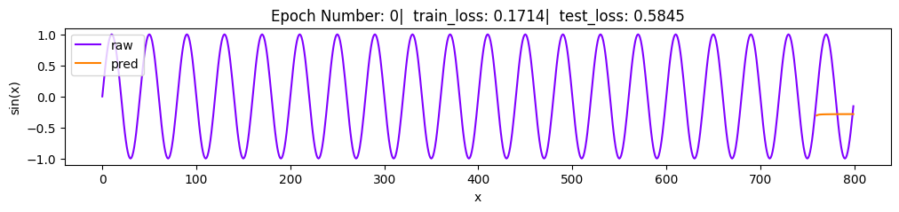
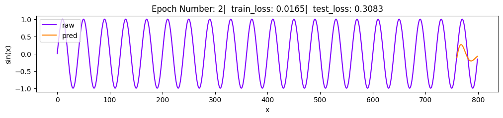
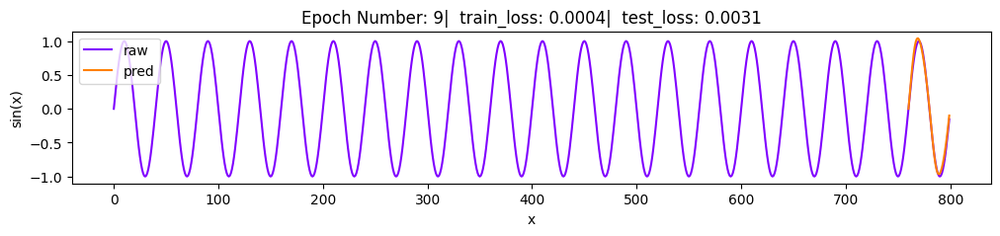

# Custom LSTM Experiments

```bash
This repository contains two projects implementing a **custom LSTM cell** from scratch in PyTorch, demonstrating its capability on distinct sequence modeling tasks:

- **Binary Counting**: Learning to predict the sum of binary sequences.
- **Sine Wave Prediction**: Forecasting a sine wave time series.
```
---

## Motivation

```bash
While PyTorch provides built-in LSTM layers, implementing one from scratch provides deep insight into
the internal workings of recurrent units, gate mechanisms, and parameter initialization. This repository
showcases how a custom LSTM can be constructed and trained end-to-end on meaningful problems.

```
---

##  Project Structure

```bash

custom-lstm-experiments/
    ├── lstm_cell.py               # Custom LSTMCell implementation
    ├── binary_counting.py         # Binary sequence sum prediction project
    ├── sine_wave_prediction.py    # Sine wave forecasting project
    ├── demo_script.py             # Script for quick testing and training
    ├── demo.ipynb                 # Notebook with explanation, visualizations, and conclusions
    ├── README.md                  # This file
    └── requirements.txt           # Dependencies

```
---

## Getting Started

### Requirements

```bash
 Install dependencies with:

    pip install -r requirements.txt
    
```
 ### Running the Demo:
 ```bash
     python demo_script.py
     demo.ipynb
```
---

## Results

## Binary Counting Project

This project trains the custom LSTM to predict the sum of binary sequences of length 20. The
task illustrates the model’s ability to learn long-range dependencies.

### Training Progress Summary (20 epochs)
```bash
| Epoch | Train Loss | Train Accuracy | Valid Loss | Valid Accuracy |
|-------|------------|----------------|------------|----------------|
| 0     | 23.0181    | 10.06%         | 4.8247     | 16.70%         |
| 5     | 0.0314     | 97.94%         | 0.0156     | 98.10%         |
| 10    | 0.0058     | 99.88%         | 0.0039     | 100.00%        |
| 15    | 0.0031     | 99.92%         | 0.0033     | 100.00%        |
| 19    | 0.0020     | 100.00%        | 0.0021     | 100.00%        |

The model rapidly converges to perfect accuracy on validation data, showing it effectively
learns the counting problem.

**Visualization:** See below for plots showing training curves and before/after prediction
results.
```
---

---

## Sine Wave Prediction Project

```bash
This project uses the same custom LSTM cell architecture to predict the next values in a sine wave
time series using a sliding window approach.

- Trains on 760 points of sine data, predicts the next 40 points.
- Demonstrates the model’s ability to capture smooth oscillatory patterns.
- Includes training loss and test loss evaluation per epoch.

**Visualization:** See below plots showing how the model improves over epochs.
```
---



---

## Conclusion

```bash

This repo demonstrates that a custom-built LSTM cell can learn to solve classical sequence tasks effectively,
bridging theory and practical implementation. It offers a solid foundation for understanding RNN internals
and experimenting with custom architectures.

```
---

