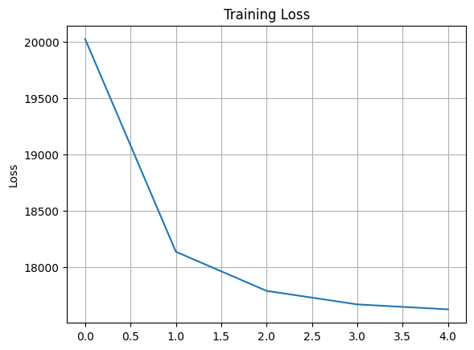

# Character-Level Text Generation with LSTM

*A Deep Learning Model Trained to Mimic Jules Verne's Writing Style*

This project demonstrates how a character-level LSTM neural network can be used to generate English text — one character
at a time — in the style of classic literature. Trained on Jules Verne’s *The Mysterious Island*, the model learns the
intricacies of language structure, punctuation, and narrative flow, producing surprisingly coherent sequences from scratch.

The primary goal is to explore how deep learning models can internalize and recreate the stylistic and structural patterns
of natural language when trained on nothing more than raw characters.

Whether you're here to dive into NLP, experiment with text generation, or just watch a neural net attempt to write like
Jules Verne, this project has something for you.

---

## Motivation & Project Overview

```bash

Language is one of the most complex and fascinating aspects of human intelligence. The ability to model, understand, and
generate coherent text from scratch has long been a benchmark in natural language processing (NLP). While large-scale language
models dominate the headlines today, there’s still immense educational value in building models from the ground up — character
by character.

This project focuses on:

- Training a **character-level LSTM model** on raw text (no word tokenization).
- Exploring how much linguistic structure a model can learn from just **sequences of characters**.
- Demonstrating the effects of different **sampling strategies and temperatures** on text creativity.
- Building a minimal, modular, and reproducible pipeline using **PyTorch**.

By using Jules Verne’s *The Mysterious Island* as a training corpus, we allow the model to learn narrative style, punctuation rhythm, and character transitions directly from a classic literary work — and then attempt to generate new text that *feels* like it could have come from the same novel.

This is a great learning tool for understanding:
- How RNNs work under the hood
- Sequence modeling in PyTorch
- The importance of model design choices in generative tasks

```
---

## Dataset & Preprocessing

This project uses the full-text novel **_The Mysterious Island_ by Jules Verne**, which is in the public domain and freely
available through [Project Gutenberg](https://www.gutenberg.org/ebooks/1268).

### Why This Dataset?
``` bash
- Rich, descriptive language typical of 19th-century literature
- Long, coherent narrative structure ideal for modeling temporal sequences
- Clean, linear text with minimal formatting — perfect for character-level modeling
```

### Preprocessing Steps
```bash

The goal is to convert raw text into a structured dataset of overlapping character sequences that the LSTM model can learnfrom.

1. **Text Extraction**  
   The novel is downloaded directly using `wget` and truncated to remove Project Gutenberg's boilerplate header/footer content.

2. **Character Vocabulary Creation**  
   - A set of all unique characters in the text is created (including punctuation, whitespace, and case).
   - Each character is mapped to a unique integer (`char2int`) and vice versa.

3. **Integer Encoding**  
   The entire corpus is encoded into an array of integers based on the character mapping.

4. **Sequence Chunks**  
   The encoded text is split into overlapping sequences of length `SEQUENCE_LENGTH + 1`:
   - The first `SEQUENCE_LENGTH` characters form the input.
   - The next character becomes the target (what the model should predict next).

5. **Train/Validation Split**  
   - The full dataset is wrapped in a custom `TextDataset` class.
   - Split 90%/10% into training and validation datasets.
   - Loaded into PyTorch `DataLoader` objects with batching and shuffling.

This preprocessing ensures the model sees a continuous stream of character sequences and learns how characters relate to each other over time — a foundational skill in text generation tasks.

```
---

##  Project Structure

```bash

text-generation-lstm/
    │
    ├── model.py                 # Character-level LSTM model definition
    ├── dataloader_generator.py # Text preprocessing, dataset, and dataloader setup
    ├── utils.py                 # Helper functions (text generation, gradient norm, etc.)
    ├── demo_script.py           # Script to train model and generate text
    ├── demo.ipynb               # Jupyter notebook demo with training and generation
    ├── requirements.txt         # Project dependencies
    ├── README.md                # Project overview, setup, and usage


```
---

## Getting Started

### Requirements

```bash
 Install dependencies with:

    pip install -r requirements.txt
    
```
 ### Running the Demo:
 ```bash
     python demo_script.py
     jupyter notebook demo.ipynb
     
```
---

## Training Results

The model was trained on Jules Verne’s The Mysterious Island using character-level LSTM.
Training was run on GPU with the following configuration:

    Epochs: 5
    Sequence Length: 30
    Batch Size: 64
    Embedding Dimension: 256
    Hidden Size: 512

Generated Text(after 5 epochs) Shown below

Note: The model begins to mimic sentence structure and vocabulary even after a few epochs.
With longer training, output fluency improves significantly.

### 1. Using Greedy(Argmax):

```bash
The island, and the sea was the settlers were already enough to the shore, 
the settlers were already explored the sailor and his companions...

```
### 2. Random Sampling – Temperature = 1.0
```bash
The island
southwested, or spake which emerged it the engineer which rose to a half operation...
```

### 3. Random Sampling – Temperature = 2.0

```bash
The island to be touched to show that the shore, and the west.

The explorers were already enough to be seen to the summit...

```

### 4. Random Sampling – Temperature = 0.5

```bash

The island. Unother; “yit
trip.

Hes! I doubled, especial managin. Befineings, but’s! picuvals...

```
---

---


## Conclusion

```bash
This project demonstrates a simple yet effective character-level text generation pipeline using an LSTM network.
Despite being trained for only a few epochs, the model begins to capture patterns, punctuation, and structure from
classic literature. With more training time or architectural improvements (e.g. deeper LSTMs, attention, or transformers),
the quality and coherence of generated text would improve further.

This setup serves as a solid foundation for exploring sequence modeling, generative text tasks, or even fine-tuning on
domain-specific corpora.

```
---
